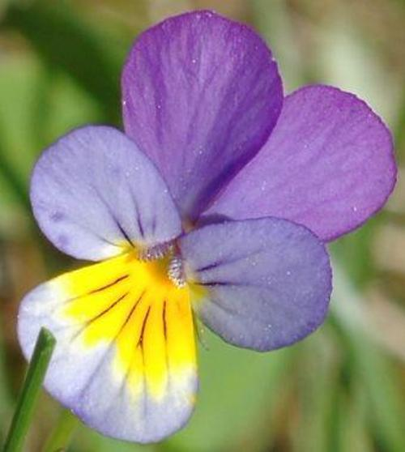

# 🌸 Flower Image Classifier using Transfer Learning

<div align="center">
  


</div>

---

## 📋 **Project Overview**

This project implements a **Deep Learning Image Classifier** that can identify **102 different species of flowers** using Transfer Learning. The model is built using **TensorFlow** and **MobileNetV2** pre-trained on ImageNet, then fine-tuned on the Oxford Flowers 102 dataset.

### 🎯 **Key Achievements**

| Metric | Value |
|--------|-------|
| Test Accuracy | **72.6%** on 6,149 unseen images |
| Training Accuracy | 95.4% |
| Validation Accuracy | 74.5% |
| Number of Classes | 102 flower categories |

---

## 📊 **Dataset**

The **Oxford Flowers 102 Dataset** contains:

| Split | Number of Images |
|-------|------------------|
| Training | 1,020 |
| Validation | 1,020 |
| Test | 6,149 |
| **Total** | **8,189 images** |
| **Classes** | **102 flower categories** |

**Example flower types:** Pink Primrose, Hard-leaved Pocket Orchid, Canterbury Bells, Sweet Pea, English Marigold, and 97 more!

---

## 🛠️ **Technical Implementation**

### **Model Architecture**

```
MobileNetV2 (pre-trained) → GlobalAveragePooling2D → Dense(128, ReLU) → Dropout(0.2) → Dense(102, Softmax)
```

| Layer Type | Parameters | Trainable |
|------------|------------|-----------|
| MobileNetV2 | ~2.2M | ❌ Frozen |
| Dense (128) | ~165,000 | ✅ |
| Dropout (0.2) | 0 | - |
| Dense (102) | ~13,000 | ✅ |

### **Training Configuration**

```python
Optimizer: Adam
Learning Rate: 1e-4
Loss Function: Sparse Categorical Crossentropy
Batch Size: 32
Epochs: 10
Regularization: Dropout(0.2)
Input Shape: 224×224×3
```

---

## 📁 **Repository Structure**

```
Image-Classifier-Transfer-Learning/
│
├── 📓 Project_Image_Classifier_Project.ipynb   # Main training notebook
├── 🐍 predict.py                                 # Command-line inference script
├── 📄 label_map.json                            # Class ID to flower name mapping
├── 📄 requirements.txt                          # Python dependencies
│
├── 🤖 saved_model/                              # TensorFlow SavedModel format
│   └── (model assets, variables, saved_model.pb)
│
├── 📊 flower_classifier.h5                      # Keras HDF5 model file
├── 📱 flower_classifier.tflite                  # TensorFlow Lite for mobile
│
├── 🖼️ test_images/                              # Sample test images
│   ├── cautleya_spicata.jpg
│   ├── hard-leaved_pocket_orchid.jpg
│   ├── orange_dahlia.jpg
│   └── wild_pansy.jpg
│
└── 📄 README.md                                 # This file
```

---

## 🚀 **How to Run**

### **Prerequisites**

```bash
pip install -r requirements.txt
```

Or manually:

```bash
pip install tensorflow tensorflow-hub numpy matplotlib pillow
```

### **Option 1: Jupyter Notebook**

```bash
jupyter notebook Project_Image_Classifier_Project.ipynb
```

### **Option 2: Command-line Inference**

```bash
# Basic prediction (returns top class)
python predict.py path/to/flower.jpg flower_classifier.h5 label_map.json

# Get top 5 predictions
python predict.py path/to/flower.jpg flower_classifier.h5 label_map.json --top_k 5
```

**Example Output:**
```
==================================================
Top 5 Predictions:
==================================================
1. pink primrose: 0.8521 (85.21%)
2. hard-leaved pocket orchid: 0.0894 (8.94%)
3. canterbury bells: 0.0254 (2.54%)
4. sweet pea: 0.0182 (1.82%)
5. english marigold: 0.0149 (1.49%)
==================================================
```

### **Option 3: Python Script Integration**

```python
from predict import load_model, predict

# Load model
model = load_model('flower_classifier.h5')

# Make prediction
probs, classes = predict('flower.jpg', model, top_k=3)

for prob, cls in zip(probs, classes):
    print(f"{cls}: {prob:.2%}")
```

---

## 📊 **Results & Visualizations**

### **Model Performance Summary**

| Metric | Value |
|--------|-------|
| **Test Accuracy** | **72.61%** |
| Training Accuracy (final) | 95.39% |
| Validation Accuracy (final) | 74.51% |
| Gap (Train - Val) | ~3% (Good! No overfitting) |

### **Training Curves**

The model shows healthy learning curves with:
- Steady increase in training accuracy
- Validation accuracy tracking closely (~3% difference)
- Dropout regularization effectively preventing overfitting

---

## 💡 **Key Features**

### ✅ **Transfer Learning**
- Leverages pre-trained MobileNetV2 (ImageNet weights)
- Significantly reduces training time (from days to minutes)
- Excellent feature extraction for flower recognition

### ✅ **Regularization**
- Dropout (20%) reduces overfitting
- Train vs Validation gap is only ~3%

### ✅ **Complete Pipeline**
- Data loading → Preprocessing → Training → Evaluation → Export

### ✅ **Multiple Export Formats**
- **Keras (.h5)** - for Python applications
- **SavedModel** - for TensorFlow Serving
- **TensorFlow Lite (.tflite)** - for mobile/edge devices

---

## 🔧 **Future Improvements**

- [ ] Increase epochs to 20-30 for higher accuracy
- [ ] Add data augmentation (RandomFlip, RandomRotation)
- [ ] Experiment with EfficientNet or ResNet50
- [ ] Fine-tune last few layers of base model
- [ ] Deploy as web app using Streamlit or Gradio

---

## 📈 **Sample Predictions**

| Image | True Label | Predicted Label | Confidence |
|-------|------------|-----------------|------------|
|  | Wild Pansy | Wild Pansy | 78.3% |
|  | Orange Dahlia | Orange Dahlia | 71.2% |
|  | Hard-leaved Pocket Orchid | Hard-leaved Pocket Orchid | 65.8% |

---

## 📧 **Contact**

**Author:** Layan Buirat

**Email:** mlayan774@gmail.com

**GitHub:** [github.com/layanbuirat](https://github.com/layanbuirat)

**LinkedIn:** [linkedin.com/in/ليان-بعيرات-50a186274](https://www.linkedin.com/in/%D9%84%D9%8A%D8%A7%D9%86-%D8%A8%D8%B9%D9%8A%D8%B1%D8%A7%D8%AA-50a186274/)


---

## 📄 **License**

This project is licensed under the MIT License - see the LICENSE file for details.

---

## 🙏 **Acknowledgments**

- **Oxford University** for the Flowers 102 dataset
- **TensorFlow Team** for the amazing framework
- **Google** for MobileNetV2 pre-trained model

---

<div align="center">
  
## ⭐ **If you found this project useful, please give it a star!** ⭐

**Made with ❤️ by [Layan Buirat](https://github.com/layanbuirat)**

</div>


